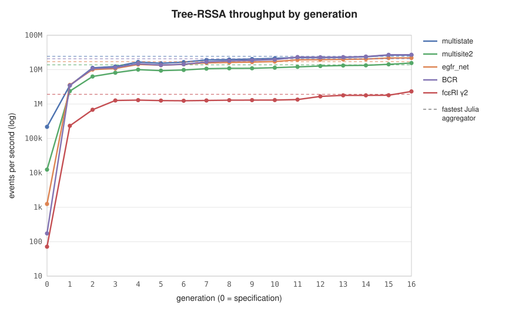
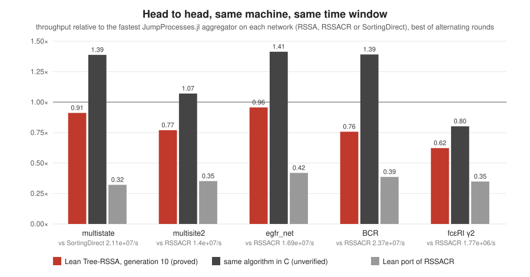

# JumpProcessesLean

Lean translations of JumpProcesses.jl's Direct, NRM, and RSSA. The same
arithmetic-parameterized code runs with FloatLib binary64 arithmetic and has a real
interpretation used by the proofs. The repository also contains
[Tree-RSSA](#tree-rssa-a-new-ssa-optimized-under-proof), a new exact SSA. It went through
sixteen optimized generations, each proved to produce exactly the specification's
trajectories. Generation 16 is faster than every JumpProcesses.jl aggregator on all five
networks of the Catalyst paper's SSA benchmark: 1.08× to 1.30× the fastest one on each
network, measured in the same time window.

**Checked (real, end to end).** The public `simulate` driver runs on the
public `tapeSource`, with a tape read from two independent IID Uniform(0,1) streams.
One stream supplies the uniform draws. The other supplies the uniforms `V` behind the
exponential draws `-log V`. Under this input, for every measurable observable of the
complete stopped trace:

* Direct and NRM have exactly the target stopped CTMC path law, hence the same law.
  NRM includes the persistent absolute clock cache, inactive, activated, deactivated
  and absorbing channels.
* Fixed-cap RSSA differs from that law only on an explicit event. On that event some
  first-success block needs more proposals than the cap. Its probability tends to
  zero, and RSSA event probabilities converge to the target as the cap grows.

No reaction-word decomposition is assumed. The word events are read off the streams
using a regeneration (strong Markov) lemma for stopping readers, and they are proved
to partition the probability space.

**Checked (FloatLib).** The FloatLib simulator reads the *same* streams through fixed
rounding maps `ρu`, `ρe`. Each algorithm has an explicit certificate event, defined by
input-only numerical conditions along the realized real reaction word. On it, the
public FloatLib simulator stays trace-close to the public real simulator. Joint tails
of any observable lie within `β` of the exact target law, which is the law of the
public real Direct and NRM simulators on the same streams. Here `β` is the outer
probability that the certificate fails. The certificates cover absorbing states. For
NRM they also cover inactive, deactivated and reactivated channels, through the masked
FloatLib cache.

| Statement | Theorem | File |
| --- | --- | --- |
| Direct = NRM = target law on IID streams; probability measure | `iid_direct_nrm_same_law` | [IIDEndToEnd.lean](JumpProcessesLean/Proofs/IIDEndToEnd.lean) |
| Capped RSSA probabilities converge to the target | `iid_rssa_tendsto_target` | [IIDEndToEnd.lean](JumpProcessesLean/Proofs/IIDEndToEnd.lean) |
| Direct law on IID streams | `direct_iid_simulation_law` | [DirectIID.lean](JumpProcessesLean/Proofs/DirectIID.lean) |
| NRM law on IID streams | `nrm_iid_simulation_law` | [NRMIID.lean](JumpProcessesLean/Proofs/NRMIID.lean) |
| Capped RSSA sandwich and defect limit | `rssa_iid_capped_simulation_law`, `rssaCapDefect_tendsto_zero` | [RSSAIID.lean](JumpProcessesLean/Proofs/RSSAIID.lean) |
| Float Direct/NRM joint tails within `β` of the real simulators' law | `iid_float_direct_approximates_real`, `iid_float_nrm_approximates_real` | [FloatEndToEnd.lean](JumpProcessesLean/Proofs/FloatEndToEnd.lean) |
| Float trace closeness on the certificate event | `direct_float_iid_stop_close`, `nrm_float_iid_masked_close`, `rssa_float_iid_stop_close` | [FloatIIDStop.lean](JumpProcessesLean/Proofs/FloatIIDStop.lean) |
| Float joint-tail bounds against the target | `direct_float_iid_stop_law_bounds`, `nrm_float_iid_masked_law_bounds`, `rssa_float_iid_stop_law_bounds` | [FloatIIDStop.lean](JumpProcessesLean/Proofs/FloatIIDStop.lean) |
| Positive-rate special cases, with a `β` that is never smaller | `*_float_iid_close`, `*_float_iid_law_bounds`; `iid_float_stop_failure_le` | [FloatIID.lean](JumpProcessesLean/Proofs/FloatIID.lean), [FloatEndToEnd.lean](JumpProcessesLean/Proofs/FloatEndToEnd.lean) |

[PROOFS.md](PROOFS.md) states the hypotheses precisely and maps the proof architecture.

## Tree-RSSA: a new SSA, optimized under proof

[`TreeRSSA.lean`](JumpProcessesLean/TreeRSSA.lean) defines **Tree-RSSA**. It is RSSA on
mass-action networks, with JumpProcesses.jl's species population brackets and a binary sum
tree over the upper propensity bounds. A candidate costs one tree descent, not a linear
search. A bracket refresh re-adds only the tree paths of the changed bounds. The
specification is generic in the arithmetic and the random source, like the drivers above.

**Correctness.** In the reals, Tree-RSSA *is* the public `simulate … .rssa` on a bracket
model (`treeRSSA_simulate_eq`). So on the IID streams its event probabilities are within
the cap defect of the exact stopped-path law (`tree_rssa_iid_capped_law`), and they
converge to those of Gillespie's Direct method as the cap grows
(`tree_rssa_tendsto_direct`). On host floats with the xoshiro256++ source, each of sixteen
optimized **generations** is proved to return exactly what the specification returns, bit
for bit, for every input and every network whose reactant species are in range
(`gen1_simulate_eq` … `gen16_simulate_eq`). Speed never changes the result: all
generations produce the same trajectory for the same seed.

The host source draws uniforms from a word's top 53 bits and exponentials by a 256-layer
ziggurat (Marsaglia and Tsang), the method of Julia's `randexp`: 98% of draws cost one word,
a multiplication and a comparison. The rare slow path makes one tail or wedge attempt and
otherwise returns `-log V` of a fresh uniform; each branch is an exact `Exp(1)` sample in
real arithmetic. Like xoshiro256++ itself, this executable source is outside the proofs,
which cover the specification for every source.

| Generation | Change | Proof |
| --- | --- | --- |
| 0 | the specification: segment-tree recursion over the bounds | `treeRSSA_simulate_eq` |
| 1 | flat `FloatArray` sum tree, incremental path updates | `gen1_simulate_eq` |
| 2 | native float operations, inlined draws, unchanged leaves kept | `gen2_simulate_eq` |
| 3 | compiled mass-action factors; the paths of one refresh re-added together | `gen3_simulate_eq` |
| 4 | one allocation-free tail-recursive driver | `gen4_eq_gen3` |
| 5 | per-species contiguous records; bounds with unchanged integer factors skipped | `gen5_eq_gen4` |
| 6 | exact propensity only when the lower bound rejects; natural-number updates | `gen6_eq_gen5` |
| 7 | finiteness as two inline comparisons (`isFinite_eq_lt`, in Lean's float model) | `gen7_eq_gen6` |
| 8 | no reference counting on the proposal path | `gen8_eq_gen7` |
| 9 | inlined staleness test on firing | `gen9_eq_gen8` |
| 10 | single-comparison tests: no reference-counted joins per proposal | `gen10_eq_gen9` |
| 11 | descent on machine words, its bound carried by the loop | `gen11_eq_gen10` |
| 12 | tree paths on machine words, each sum carried up (`float_add_comm`) | `gen12_eq_gen11` |
| 13 | the dependents' factors as integer codes in flat arrays | `gen13_eq_gen12` |
| 14 | the tree size tested once per proposal: no join after the descent | `gen14_eq_gen13` |
| 15 | firing on machine words; refresh fold only when a bracket is left | `gen15_eq_gen14` |
| 16 | refreshes on machine words: products only for changed bounds | `gen16_eq_gen15` |

Also in Lean: [a port of JumpProcesses.jl's RSSACR](JumpProcessesLean/Ports/RSSACR.lean),
its fastest aggregator on four of the five networks below (unverified, for comparison).

### Benchmark

The five networks of the Catalyst paper's SSA benchmark, from
[Catalyst_PLOS_COMPBIO_2023](https://github.com/SciML/Catalyst_PLOS_COMPBIO_2023)
(MIT, vendored in [`bench/models/catalyst`](bench/models/catalyst)):

| Network | Species | Reactions | Span |
| --- | ---: | ---: | ---: |
| multistate | 9 | 18 | 10000 |
| multisite2 | 66 | 288 | 300 |
| egfr_net | 356 | 3749 | 30 |
| BCR | 1122 | 24388 | 10 |
| fceri_gamma2 | 3744 | 58276 | 300 |

Every method simulates the full network on `(0, T)` from the initial populations. Julia
runs the nine JumpProcesses.jl 9.33.1 aggregators with `SSAStepper` and
`MassActionJump(…; scale_rates = false)`, warmed up. Lean runs `jumpBench`.







**Results.** Measured in the same time window, alternating rounds, best time:

| network | fastest Julia | Julia ev/s | Lean G16 ev/s | ratio | C ev/s |
|---|---|---:|---:|---:|---:|
| multistate | SortingDirect | 2.45e+07 | 2.65e+07 | 1.08 | 3.38e+07 |
| multisite2 | RSSACR | 1.42e+07 | 1.55e+07 | 1.09 | 1.59e+07 |
| egfr_net | RSSACR | 1.7e+07 | 2.21e+07 | 1.30 | 2.52e+07 |
| BCR | RSSACR | 2.48e+07 | 2.7e+07 | 1.09 | 3.64e+07 |
| fcεRI γ2 | RSSACR | 1.88e+06 | 2.34e+06 | 1.25 | 1.63e+06 |

* **Against JumpProcesses.jl:** generation 16 is 1.08× to 1.30× the fastest aggregator on
  every network, in the same window. RSSACR is the fastest Julia aggregator on four
  networks, SortingDirect on multistate; the other six are slower on every network (table
  below).
* **Generation 16 against generation 0:** 6,696× faster (geometric mean over the five
  networks): from 72–218,000 events per second for the specification to 2.3–27 million.
  Generations 11 to 16 alone gained 1.24× to 1.78× over generation 10.
* **Against the Lean RSSACR port:** 3.2× to 4.1× faster on every network.
* **The independent C implementation** of the same algorithm ends every run with the same
  final populations as generations 2 to 16. It is straightforward C: each refresh computes
  the product of every dependent bound and re-adds each changed leaf's path to the root.
  On the first four networks it is 1.02× to 1.35× generation 16: the overhead that remains
  in Lean's generated code. On fcεRI γ2, refreshes dominate, with about 38 dependent bound
  evaluations per event. Generation 16 skips the products whose integer factors are
  unchanged and re-adds the paths of one refresh together, so there it is 1.44× the C.

The numbers come from a shared machine with other jobs running, so ±15% between runs is
normal. Each script records the machine, the commit, and whether the working tree had
uncommitted changes (`dirty`). `generations.py` runs the listed methods alternately and
keeps each one's best of five rounds.

<details><summary>All methods: events per second, best repetition</summary>

| method | multistate | multisite2 | egfr_net | BCR | fceri_gamma2 |
|---|---:|---:|---:|---:|---:|
| Julia Direct | 2.19e+07 | 2.32e+06 | 1.59e+05 | 1.4e+04 | 7.06e+03 |
| Julia SortingDirect | 2.44e+07 | 6.07e+06 | 4e+06 | 1.39e+06 | 5.2e+04 |
| Julia RDirect | 1.68e+07 | 4.67e+06 | 8.69e+05 | 1.05e+05 | 5.58e+04 |
| Julia FRM | 9.83e+06 | 6.76e+05 | 5e+04 | 6.63e+03 | 2.9e+03 |
| Julia NRM | 1.02e+07 | 1.75e+06 | 1.41e+06 | 5.16e+05 | 2.88e+05 |
| Julia CCNRM | 9.66e+06 | 1.86e+06 | 1.92e+06 | 7.02e+05 | 4.79e+05 |
| Julia DirectCR | 1.33e+07 | 2.4e+06 | 1.9e+06 | 6.85e+05 | 4.67e+05 |
| Julia RSSA | 2.32e+07 | 6.73e+06 | 5.18e+06 | 1.98e+07 | 1.48e+04 |
| Julia RSSACR | 1.75e+07 | 1.38e+07 | 1.71e+07 | 2.07e+07 | 1.93e+06 |
| Lean Tree-RSSA G0 | 2.18e+05 | 1.25e+04 | 1.25e+03 | 175 | 71.7 |
| Lean Tree-RSSA G1 | 3.49e+06 | 2.38e+06 | 3.6e+06 | 3.47e+06 | 2.34e+05 |
| Lean Tree-RSSA G2 | 1.13e+07 | 6.34e+06 | 1.01e+07 | 1.08e+07 | 6.84e+05 |
| Lean Tree-RSSA G3 | 1.24e+07 | 8.13e+06 | 1.08e+07 | 1.15e+07 | 1.27e+06 |
| Lean Tree-RSSA G4 | 1.67e+07 | 1e+07 | 1.42e+07 | 1.49e+07 | 1.3e+06 |
| Lean Tree-RSSA G5 | 1.53e+07 | 9.39e+06 | 1.35e+07 | 1.36e+07 | 1.26e+06 |
| Lean Tree-RSSA G6 | 1.66e+07 | 9.8e+06 | 1.43e+07 | 1.43e+07 | 1.25e+06 |
| Lean Tree-RSSA G7 | 1.91e+07 | 1.07e+07 | 1.58e+07 | 1.68e+07 | 1.27e+06 |
| Lean Tree-RSSA G8 | 1.97e+07 | 1.09e+07 | 1.62e+07 | 1.8e+07 | 1.3e+06 |
| Lean Tree-RSSA G9 | 2.03e+07 | 1.1e+07 | 1.66e+07 | 1.86e+07 | 1.3e+06 |
| Lean Tree-RSSA G10 | 2.13e+07 | 1.14e+07 | 1.72e+07 | 1.95e+07 | 1.31e+06 |
| Lean Tree-RSSA G11 | 2.23e+07 | 1.2e+07 | 1.93e+07 | 2.32e+07 | 1.35e+06 |
| Lean Tree-RSSA G12 | 2.23e+07 | 1.27e+07 | 1.95e+07 | 2.29e+07 | 1.67e+06 |
| Lean Tree-RSSA G13 | 2.26e+07 | 1.32e+07 | 1.99e+07 | 2.32e+07 | 1.8e+06 |
| Lean Tree-RSSA G14 | 2.37e+07 | 1.34e+07 | 2.04e+07 | 2.4e+07 | 1.8e+06 |
| Lean Tree-RSSA G15 | 2.65e+07 | 1.43e+07 | 2.18e+07 | 2.7e+07 | 1.8e+06 |
| Lean Tree-RSSA G16 | 2.65e+07 | 1.56e+07 | 2.2e+07 | 2.71e+07 | 2.33e+06 |
| Tree-RSSA in C (unverified cross-check) | 3.4e+07 | 1.59e+07 | 2.64e+07 | 3.63e+07 | 1.62e+06 |
| Lean RSSACR port | 6.5e+06 | 4.82e+06 | 6.89e+06 | 7.84e+06 | 6.55e+05 |
| Lean FloatLib Direct | 2.07e+04 | 1.6e+03 | 179 | 29.4 | 10.4 |
| Lean FloatLib NRM | 9.51e+03 | 557 | 115 | 17.3 | 6.14 |
| Lean FloatLib RSSA | 8.12e+03 | 599 | 46.6 | 6.37 | 2.51 |

Generations 0 and 1 and the FloatLib drivers were measured by `run.py`, with shorter
spans where the budget required (recorded in `bench/results/lean.json`). Generations 2 to
16, the port and the C implementation come from `generations.py`, and Julia from `run.py`
in its own window.

</details>

Reproduce with `lake build jumpBench`, then:

```bash
python3 bench/run.py --julia --out bench/results/julia.json       # needs JULIA=…
python3 bench/run.py --lean treerssa-spec treerssa-g1 rssacr-port direct-floatlib \
  nrm-floatlib rssa-floatlib --out bench/results/lean.json
cc -O3 -march=native -ffp-contract=off -o treerssa-c bench/c/treerssa.c -lm
CREF=./treerssa-c python3 bench/generations.py --out bench/results/generations.json \
  --methods treerssa-g2 treerssa-g3 treerssa-g4 treerssa-g5 treerssa-g6 treerssa-g7 \
  treerssa-g8 treerssa-g9 treerssa-g10 treerssa-g11 treerssa-g12 treerssa-g13 \
  treerssa-g14 treerssa-g15 treerssa-g16 rssacr-port c-reference
CREF=./treerssa-c python3 bench/generations.py --out bench/results/headtohead.json \
  --methods julia:SortingDirect julia:RSSA julia:RSSACR treerssa-g16 c-reference
python3 bench/plot.py
```

`run.py` probes each method on growing spans. It measures on the full span when the
budget allows and records a shorter span otherwise. `generations.py` runs the listed
methods alternately for several rounds on the full span and keeps each one's best time.
It checks that every Tree-RSSA generation and the independent C implementation
([`bench/c/treerssa.c`](bench/c/treerssa.c)) end with the same final populations. Setting
`BENCH_IDLE` makes both scripts wait for an idle machine first. Setting `BENCH_LOCK` to a
file makes each timed run hold an exclusive lock on it, so cooperating benchmark processes on
a shared machine never time runs at the same moment.

## Build and test

Install Elan and Julia 1.11 or later, then run `bash scripts/verify.sh`. It runs:

1. `lake build` for all proofs;
2. `lake test` for the native FloatLib executables;
3. the theorem dependency audit of `Tests/Trust.lean` (275 results);
4. the original Julia fixtures.

Logs are written to `results/`. The first native build compiles FloatLib's C
dependencies. Toolchain and dependency revisions are pinned, and CI runs the same
steps on every push.

## Translation scope

Models are finite homogeneous pure-jump systems. Rates can depend on the state and
stay constant between jumps. Models supply rates, indexed transitions, and enclosing
bounds. Population brackets and mass-action helpers are included.

| Algorithm | Preserved mechanism | Implementation choice |
| --- | --- | --- |
| Direct | Cumulative selection and a total-rate exponential | Strict CDF endpoints skip zero-rate channels |
| NRM | Persistent clocks, fresh fired/reactivated clocks, residual rescaling | Linear argmin; simulation uses the complete dependency graph |
| RSSA | Upper-rate proposals, lower acceptance shortcut, accumulated Exp(1) clocks | Bounds checked per event; proposal exhaustion reports an error |

Inactive NRM clocks are `none` and consume no exponential draw. Seeded trajectories
need not match Julia, which uses a different RNG and infinity representation.
Duplicate dependencies consume no extra samples. Every rescaling uses the old state.

The scope excludes the SciML integrator/callback framework, ODE/SDE coupling,
variable-rate jumps, GPU support, heap optimization, and cached RSSA
species/dependency bracket updates.

All default simulation arithmetic and logarithms use FloatLib. SplitMix64 is a
reproducible executable source. No theorem claims that it is an IID continuous
source; the theorems quantify over IID streams and over arbitrary rounding maps.

## How the real proof works

1. **IID streams.** `iidStreams` is the infinite product of Uniform(0,1) over two
   streams. `iidStreams_split` proves that a finite prefix is independent of the
   remaining streams, which are again IID.
2. **Regeneration.** A *stopping reader* consumes a data-dependent number of draws,
   determined by what it reads. `StreamReader.regenerate` proves that the value read is
   independent of the unread streams, which are again IID. `readerParse_law` composes
   readers: the blocks read are independent with the readers' laws.
3. **Algorithm readers.**
   * A Direct event reads one uniform and one exponential source.
   * An NRM row reads the exponential sources its native update actually consumes
     (`freshPattern`). Its other coordinates come from the otherwise unused uniform
     stream, so every row is exactly IID.
   * An RSSA event reads selection/acceptance/exponential proposals until the first
     acceptance. `rssaReader_law` proves its law is the first-success stopping measure.
4. **Word events.** Along a reaction word, each reader uses the rates of the state
   reached so far. The event that the streams realize the word is a branch of the
   parsed blocks. Distinct words give disjoint events, by the uniqueness of each
   native choice (CDF selection, strict NRM race, first acceptance). Total mass one
   follows from `path_word_weights_normalize`.
5. **Driver execution.** On each word event, almost surely, the public `simulate` on
   the stream tape executes exactly the parsed transcript, followed by an arbitrary
   unread suffix. This covers the persistent absolute NRM cache, absorbing states,
   horizon stopping, recording, event-budget errors and the RSSA cap.
6. **Per-word laws.** The parsed blocks restricted to a word event have the primitive
   word measure. Earlier modules prove that its holding times have the
   marked-exponential law (`direct_packet_clock_law`, `masked_cached_word_law` /
   `nrm_raw_holding_times_law`, `rssa_packet_clock_law`).

`iid_word_decomposition` assembles these into the law of the actual driver. The
earlier word-branch construction `nativeSimulationLaw` is thereby identified with the
law of the public driver on IID input.

### Earlier one-event and word-level results (still used)

| Checked result | Main theorem / module |
| --- | --- |
| Actual Direct marked exponential law, allowing zero channels | `direct_real_clock_law`, `RealSamplerLaws.lean` |
| Actual positive-rate NRM initialization/minimum law | `nrm_uniform_clock_law`, `RealSamplerLaws.lean` |
| RSSA selection/acceptance probability and first-success recursion | `proposalMark_probability`, `rssa_first_success_executes` |
| Exponential sums have Erlang laws, derived by convolution | `sum_exponentials_erlang`, `ExponentialSum.lean` |
| Infinite sum of RSSA branch laws equals the target | `rssa_validated_executable_law`, `RSSABranches.lean` |
| Actual capped RSSA failure probability `(1-A/B)^N` | `rssa_cap_failure_probability`, `RSSABranches.lean` |
| Full-graph NRM update executes fresh/rescaled/disabled clocks | `nrmUpdate_uniform_executes`, `NRMUpdate.lean` |
| Joint law of winner time and updated residual vector, incl. inactive channels | `masked_transition_full_law`, `MaskedTransition.lean` |
| Independence of the cache from the whole sampled past | `masked_history_step_factorization`, `MaskedCache.lean` |
| Iterated cache law along every reaction word | `masked_cached_word_law`, `MaskedCache.lean` |

## FloatLib approximation

`FloatApproximation.lean` proves binary64 half-ULP bounds for add, subtract, multiply
and divide, including subnormals, under finite-input/output conditions. It also proves
left-fold, clock-expression and Gibson–Bruck rescaling budgets. Certified logarithm
success gives its rounding bound.

**Coupling.** `floatStreamTape ρu ρe a b ω` fills the FloatLib tape with `ρu (U i)`
and `ρe (V i)`; the real tape holds `U i` and `-log (V i)`. The rounding maps are
arbitrary functions `ℝ → Binary64`; their source error enters the certificates.
Nothing depends on the reaction word.

**Certificate events.** Each event requires numerical conditions along the realized
real word, up to a stop index `m ≤ fuel+1`. Every step before `m` carries a one-event
certificate. If `m ≤ fuel`, the word reaches an absorbing state at step `m`. Input-only
flags on the float rates there show that the native FloatLib sampler also reports
absorption.

* `directFloatStopGood` uses `DirectStopConditions`. Before the stop it checks
  propensity folds, source error, CDF margins, finite clocks, the accumulated budget
  and horizon margins. At the stop it requires valid rates whose finite float total is
  not positive.
* `nrmFloatMaskedGood` uses `NRMMaskedConditions` for the masked FloatLib cache, in
  which inactive channels are `none` and consume no draw. For the active channels it
  checks initial clocks, update rounding, source budgets and race gaps. It also checks
  finite caches and horizon margins. At the stop every float rate must be inactive.
  The cache error recurrence is proved by induction
  (`nrm_float_masked_cache_errors`), not assumed.
* `rssaFloatStopGood` uses `RSSAStopConditions`. Before the stop it checks bounds,
  every rejected and accepted proposal comparison, clock folds and horizon margins. At
  the stop it requires valid bounds and no active float rate. It also requires the
  realized first-success blocks to fit in the cap.

The Direct and RSSA events also state that the real total rate is zero at the stop.
The NRM event derives this from its flags. The certificates constrain inputs and
evaluated expressions only. They contain no assumed sampler law and no output
agreement.

The positive-rate events `directFloatGood`, `nrmFloatGood` and `rssaFloatGood` of
`FloatIID.lean` are the special case `m = fuel+1` with every NRM channel active.
`iid_float_stop_failure_le` proves that they are contained in the new events, so the
new `β` is never larger.

**Results.** On the certificate event, `direct_float_iid_stop_close`,
`nrm_float_iid_masked_close` and `rssa_float_iid_stop_close` prove `TraceClose δ`
between the two public simulators: same terminal state, event count and error
outcome, every recorded state, and every timestamp within `δ`. The real side uses
`packet_real_replay_stop_eq_holdings` and `nrm_masked_real_replay_eq_holdings`: the
stopped replay of the certified schedule is the holding-time replay of the target law.
If an observable changes by at most `ε` between `δ`-close traces, the law theorems
`direct_float_iid_stop_law_bounds`, `nrm_float_iid_masked_law_bounds` and
`rssa_float_iid_stop_law_bounds` give

```text
P_target(T > t+ε, I=i) ≤ P_float(T > t, I=i) + β
P_float(T > t, I=i) ≤ P_target(T > t-ε, I=i) + β
```

Here `β` is the outer probability that the certificate fails, and `P_float` is the
outer probability of the FloatLib event; no measurability of FloatLib outputs is
needed. `P_target` is the target law with the decoded binary64 rates. By
`direct_iid_simulation_law` and `nrm_iid_simulation_law` it is the law of the public
real Direct and NRM simulators on the same streams.
`iid_float_direct_approximates_real` and `iid_float_nrm_approximates_real` state the
bounds in that form. `recorded_trace_observables_close`
supplies concrete observables with `ε = δ`: any recorded timestamp, with the terminal
state/count/error outcome.

## Theorem scope

* **Real.** A fixed nonempty finite channel set; nonnegative state-dependent
  propensities; nonnegative enclosing bounds; total indexed transitions matching the
  model. Inactive and absorbing states are included, as is every finite event budget.
  `start < horizon`; the executable wrapper handles equal endpoints. Tapes must hold
  enough draws:
  * Direct: `a, b ≥ fuel+1`;
  * NRM: `b ≥ (n+1)(fuel+1)`;
  * RSSA with cap `N`: `a ≥ 2N(fuel+1)`, `b ≥ N(fuel+1)`.
* **RSSA cap.** With a fixed cap the law is exact only off the cap-defect event, and the
  public driver can return `proposalLimit`. The defect tends to zero
  (`rssaCapDefect_tendsto_zero`). The one-event failure mass is `(1-A/B)^N`
  (`rssa_cap_failure_probability`).
* **FloatLib.** These are certified coupling bounds. Their quality depends on `β`, and
  no theorem bounds `β` for a particular model. Within the certificates:
  * all three algorithms may reach an absorbing state within the event budget;
  * NRM channels may be inactive, deactivated or reactivated along the word;
  * Direct needs a positive total rate, and RSSA an accepted proposal, at every
    certified step before the stop.

  The real reference rates are the exactly decoded binary64 propensities.
* **Tree-RSSA.** The real results assume nonnegative rate constants, in-range species and
  an initial state within its brackets; the executable equalities assume in-range
  reactant species. Executable Tree-RSSA runs Lean's `Float`: the equalities hold in
  Lean's logical model of `Float`, and compiled code trusts the C implementations of
  its `@[extern]` operations, including the C library's `log` and `exp`. xoshiro256++ is a
  pseudo-random generator, and its outputs are not claimed to be IID.
* No nonexplosion or infinite-time CTMC extension is claimed.

There are no project proof placeholders, extra axioms, `native_decide`, or unsafe
code. `Tests/Trust.lean` audits 275 principal results. `scripts/audit.py` rejects
forbidden tokens in all project sources and accepts only Lean's standard `propext`,
`Classical.choice` and `Quot.sound`.

## Test evidence

The successful logs are in `results/`.

* Deterministic FloatLib fixtures cover:
  * zero rates;
  * NRM fresh/rescaled/activated/disabled clocks;
  * ties and duplicate dependencies;
  * RSSA rejection-clock accumulation;
  * malformed bounds and proposal exhaustion;
  * mass action and brackets.
* 20,000 event samples per algorithm test the explicit `[1,3]` joint clock/mark law.
* 8,000 trajectories per algorithm reproduce the upstream linear A→B scenario:
  16 channels, A=100, rates 0.1 through 1.6, horizon 0.1, original tolerance 1.
* Conservation, extinction, terminal horizon and chronological traces are checked.
* A Julia harness executes the pinned original algorithm bodies with 8 deterministic
  assertions. Integrator, random-tape and heap interfaces are stubbed, and the full
  SciML suite was not run. Vendored sources keep the upstream MIT license.

| Algorithm | Mean (target 0.25) | Variance (target 0.0625) | P(channel 1), zero-based (target 0.75) | A→B mean (target 25.666078) |
| --- | ---: | ---: | ---: | ---: |
| Direct | 0.249413 | 0.063395 | 0.752250 | 25.706750 |
| NRM | 0.249802 | 0.062566 | 0.747800 | 25.659750 |
| RSSA | 0.249844 | 0.061971 | 0.750700 | 25.655750 |

## Pinned revisions

* JumpProcesses.jl: `3c8c8edc8d8a84c47a7200064ab1f2fedd2ee22d`
* FloatLib: `1e83f09ed8c41a953cf8f93d26c210778177b94a`
* Mathlib: `5ed2965256430c3649e86755f9576b54eca72435`
* Lean 4.34.0; Julia fixture runtime 1.11.7.
* Benchmark: Catalyst_PLOS_COMPBIO_2023 models at
  `b850e1336a8f0fc672311d913287d2b90749f2d2`; JumpProcesses.jl 9.33.1 with the Julia
  environment in `bench/julia/Manifest.toml`.

The project is MIT licensed. Upstream licensing is in
`vendor/JumpProcesses.jl/LICENSE.md`.
